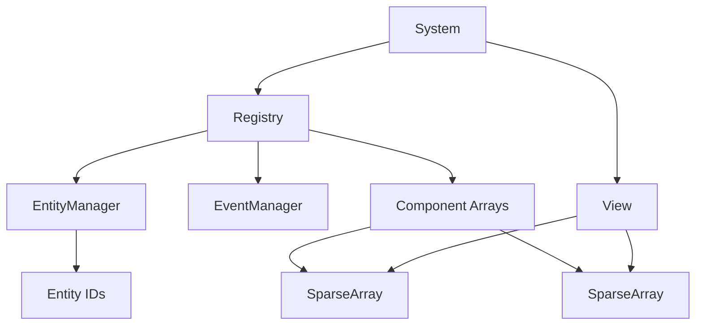

# ECS Architecture Overview

The **Entity Component System (ECS)** is a software architectural pattern mostly used in video game development for the representation of game world objects. An ECS comprises entities composed of components of data, with systems which operate on entities' components.

## Core Concepts

### 1. Entity
An **Entity** is a general purpose object. Ideally, it consists only of a unique identifier. They "exist" by the virtue of being managed by the `Registry` and having components attached to them.

### 2. Component
A **Component** is the raw data for one aspect of the object, and how it interacts with the world. For example, a `Position` component might just hold `x` and `y` coordinates.

### 3. System
A **System** performs global actions on every Entity that possesses a component of the same aspect as that System. For example, a `Movement` system might iterate over all entities that have a `Position` and `Velocity` component, and update the position based on the velocity.

### 4. Registry
The **Registry** is the central hub of the ECS. It manages:
- **Entities**: Creation and destruction.
- **Components**: Storage (via `SparseArray`), addition, and removal.
- **Events**: A communication bus for decoupled interaction.

## Diagram



## Quick Start

```cpp
#include "Registry.hpp"
#include "SystemManager.hpp"

// 1. Define Components
struct Position { float x, y; };
struct Velocity { float vx, vy; };

// 2. Define System
class MovementSystem : public ISystem {
public:
    void update(Registry& r, float dt) override {
        // ... logic
    }
};

int main() {
    Registry registry;
    SystemManager sysManager;

    // 3. Register Components
    registry.registerComponent<Position>();
    registry.registerComponent<Velocity>();

    // 4. Register System
    sysManager.registerSystem<MovementSystem>(registry);

    // 5. Create Entity
    auto entity = registry.spawnEntity();
    registry.addComponent<Position>(entity, 0.0f, 0.0f);
    registry.addComponent<Velocity>(entity, 1.0f, 0.0f);

    // 6. Game Loop
    while (true) {
        sysManager.update(registry, 0.016f);
    }
}
```
